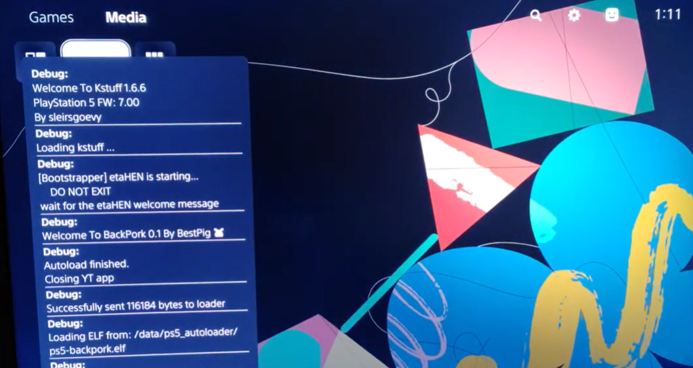
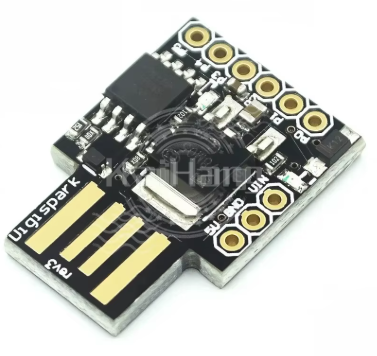
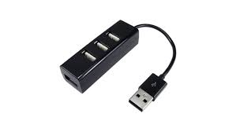

# Digispark Arduino script for the Y2JB PS5 autoloader
This is the Digispark Arduino script to run the Y2JB during a PS5 console boot. It's used to simplify the process of launching the jailbreak exploint during the cold boot. It was tested on PS5 7.0, Y2JB Lapse 1.1, Autoloader v0.4, Y2JB 1.3, etaHEN 2.4B and kstuff 1.6. Script has an ability to automatically close the Itemzflow welcome message so you can land directly in the games selection screen. Feel free to adjust the script as you probably need different delay times for your configuration!

# Demo Video (click to view on YouTube)

[](https://www.youtube.com/watch?v=aAj7G-O3IIM)


# Prerequisites
- Digispark ATTINY85  device (you can buy one from the Aliexpress or Amazon)


- (optional) any USB **2.0** HUB (it shouldn't be USB 3.0 hub). I'm not an expert, but I've heard Digispark works better while using USB 2.0 connection


-  Arduino IDE
-  Digispark drivers
-  PS5 with Y2JB autoloader configured
-  PS5 configured to log in automatically

# PS5 optional configuration
I prefer to run the Itemzflow while the etaHEN is starting (please remember to run the etaHEN payload for your ps5_autoloader installation! Detailed guide can be found [here](https://github.com/itsPLK/ps5_y2jb_autoloader). This can be done after the etaHEN is loaded. Just navigate to the console settings > etaHEN Toolbox > Automatically open after etaHEN loads > Itemzflow. That way Itemzflow will start automatically after the etaHEN is fully loaded. If you prefer to not run the Itemzflow PKG app please remember to remove the last 2 lines inside the `setup()` function (delay and pressing the ENTER button).

# Log In to PS5 automatically
It's suggested to turn on the setting which automatically logs you to your user account when you launch the console. To do so, turn on your console, navigate to the Settings > Users and Accounts > Login Settings and turn on the "Log Into PS5 automatically".

# Digispark drivers installation
Before plugging your Digispark into the computer's USB port it's required to install the required drivers. These can be found [here](https://github.com/digistump/DigistumpArduino/releases/download/1.6.7/Digistump.Drivers.zip). If the link is down, please search for the "Digistump Drivers" in Google Search. Unpack the drivers and run the **DPinst64.exe** app located in the **Digistump Drivers** folder. INstall the drivers.

# Arduino IDE installation
- Install the LEGACY Arduino IDE from here https://www.arduino.cc/en/software/ - by the time being current version is 1.8.19.
- Click on File > Preferences.
- For the **Additional Boards Manager URLs** paste the following URL `https://raw.githubusercontent.com/digistump/arduino-boards-index/master/package_digistump_index.json` and press OK button.
- Click on Tools > Board > Board Manager.
- Inside the search field type **digispark**.
- Install the **Digistump AVR Boards**.
- Close the modal screen.
- Click on Tools > Board > Digistump AVR Boards > Digispark (Default 16.5 Mhz).
- Click on Tools > Programmer > Micronucleus.

# Script installation
Paste the following script inside the Arduino IDE application.
```java
#include "DigiKeyboard.h"

void setup() {
  DigiKeyboard.sendKeyStroke(0); // Wake up
  delay(28000);                  // Please change this value. We wait for 28 seconds (28 * 1000) before pressing the buttons
  press(0x52);                   // Press the UP ARROW key
  DigiKeyboard.delay(500);       // Wait 500 ms
  press(0x4f);                   // Press RIGHT ARROW key
  DigiKeyboard.delay(500);       // Wait 500 ms
  press(40);                     // Press ENTER key
  DigiKeyboard.delay(500);       // Wait 500 ms
  press(40);                     // Press ENTER key
  delay(27000);                  // Wait 27 seconds, if you are not launching Itemzflow automatically, remove this line
  press(40);                     // Press ENTER key, if you are not launching Itemzflow automatically, remove this line
}

void loop() {
}

void press(byte key) {
  DigiKeyboard.sendKeyPress(key);
  DigiKeyboard.delay(220);
  DigiKeyboard.sendKeyPress(0,0);
}
```
Press the **Upload** button inside the Arduino IDE (inside the app toolbox, right arrow symbol after the checkmark symbol). Process of compiling the payload will start. If everything went smooth you should see a red message (it's not an error, everything is fine) saying
```
Running Digispark Uploader...
Plug in device now... (will timeout in 60 seconds)
```
Now it's time to plug your Digispark to your computer's USB port. It shouldn't really matter if you plug the device into USB 2.0 or USB 3.0 port for flashing. 
When successfully flashed, you can unplug your Digispark now.

# PS5 required configuration
When the Digispark device is unplugged it's time to plug it into the PS5 USB-A port of the console. **Please turn off your console first!** My personal recommendation is to use the Digispark plugged in into the USB 2.0 Hub and the hub can be plugged into the BACK port of the Playstation 5, so it's not distracting you as the Digispark has a red / green LED diode. 
When USB 2.0 hub is plugged in into the console press the PS (Playstation) button on your Dualsense controller or press the POWER button on the PS5 itself. Expected result is to Digispark automatically navigate to the "Media" tab and to launch the Y2JB autoloader. Voila!

# Known issues
- As the script is stupidly simple, it won't work when you've experienced the KP (Kernel Panic). The script wiil just wait until configured amount of time and will perform the keypresses required to trigger the exploit. I'm unsure if that can be fixed in future.
- Script is adjusted to my personal preferences, so feel free to modify it! What I mean is you should change the first delay value `delay(28000);` to your needs.
- Digispark devices can differ. There are a lot of clones which can be bought on the Aliexpress platform. I've got 2 of 'em and one uses red LED and the second one uses the green LED.
- I had a situation where I had to reflash the Digispark device (the one with the green LED as the PS5 was not discovering the device as USB keyboard).

This is my first contribution to the PS5 community. I want to say huge THANK YOU for all of the folks involved.

~ MaQ
